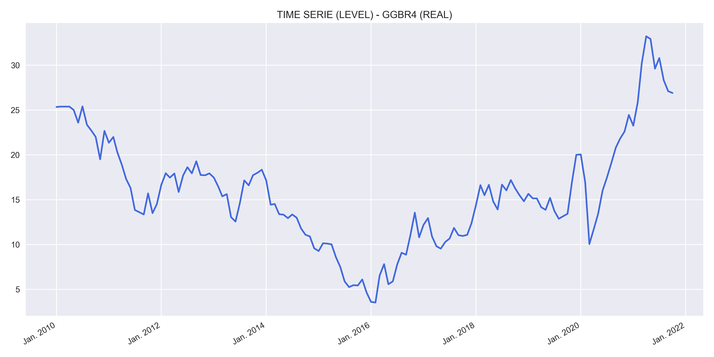
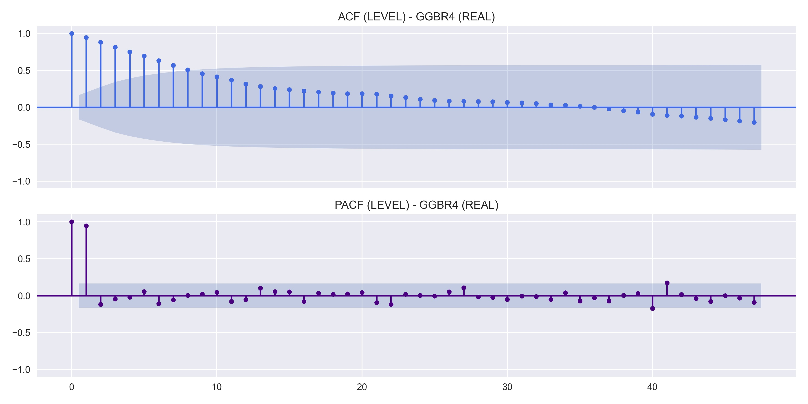
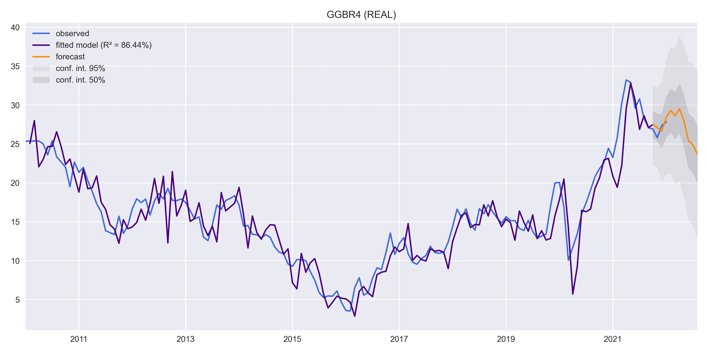

# **DESCRIPTION**

## Study of Gerdau's share price using time series and also the production of cars and the volume traded as exogenous variables. To predict the stock price, it was first necessary to make a forecast, also through time series, for the production of cars and the volume traded.

Model results for predicting car production: https://github.com/juliokozarewicz/car_production

>This is not a buy or sell recommendation, it is just a study and should not be considered when making an investment decision!

## Car Production
Values of the production of motor vehicles in the country. They reflect the sales performance of companies associated with:

• Stock and sale of vehicles by dealerships;

• Production and sales of vehicles and similar;

• Motorcycle production and sales.

## GERDAU S.A.
Gerdau is the largest producer of long steel in Latin America, with steel mills in Brazil, Argentina, Canada, Colombia, Dominican Republic, Mexico, Peru, United States, Uruguay and Venezuela. Currently, Gerdau has an installed capacity of 26 million metric tons of steel per year and offers steel for the civil construction, automobile, industrial, agricultural and various sectors. Gerdau is also the world’s 30th largest steelmaker. It has 337 industrial and commercial units and more than 30,000 employees across 10 countries. Gerdau produces long carbon steel, long special steel, flat steel and forged and cast parts. These products are used in different sectors, such as industry, metallurgy, farming and livestock, civil construction, automotive industries, petrochemicals, railway and naval sectors, in addition to orthodontic, medical and food areas. Gerdau is also the main supplier of specialty steel for the international automotive network.

Data source: Yahoo finance.

# **RESULTS**
Results obtained through the model estimation process.

## Variable analysis at level:
    
    
    
    

## SEASONAL ADJUSTMENT:
    
    

## Study of data stationarity:
    
    

## Model results:
    

## Residual analysis:
    
    
    

# MODEL TEST:
    

# FORECAST:
    
